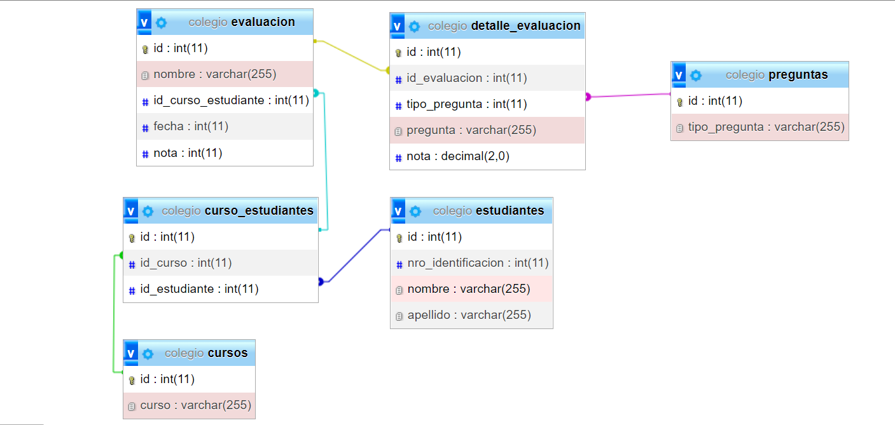

# Prueba

En el repositorio se encuentra el desarrollo de la prueba que comprende los siguientes puntos:
1. Diagrama Entidad - Relacion. ([script DB](./backend/script/)).


2. Query para obtener las calificaciones de los estudiantes con base a la DB del punto anterior.

```
SELECT es.identificacion,es.nombre_estudiante,cu.nombre_curso ,ev.nombre_evaluacion, sum(re.calificacion_respuesta) as calificacion FROM evaluacion ev 
inner join estudiante es on(ev.estudiante_id=es.id)
inner join curso cu on(ev.curso_id=cu.id)
inner join pregunta pr on(pr.evaluacion_id=ev.id)
inner join tipo_pregunta ti on(ti.id= pr.tipo_pregunta_id)
inner join respuesta re on(re.pregunta_id= pr.id)
```
3. Formulario de contacto realizado en Codeigniter (Directorio: [backend](./backend/))
4. Validación para permitir que solo se envíe una solicitud por correo al día em el formulario de contacto del punto 3.
5. Formulario de contacto realizado en React Js, el cual inserta por medio de una API. (Directorio: [frontend](./frontend/))
